

  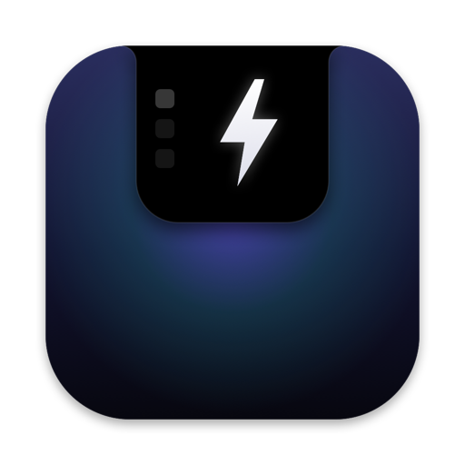

<h1 align="center">FastAction</h1>

  Your MacBook notch, turned into a quick-action panel. 
  Music, screenshots, clipboard, downloads, Pin and a translator — one hover away. 
  Tabs, sizes, alerts and plugins — all of it yours to arrange.

  <a href="https://github.com/kasaley/fastActionVersions/releases/latest"><b>⬇︎ Download the latest version</b></a>

  macOS 15 or later · Apple silicon and Intel · English, Русский, Español, Deutsch, Français

<b>English</b> · <a href="README.ru.md">Русский</a>

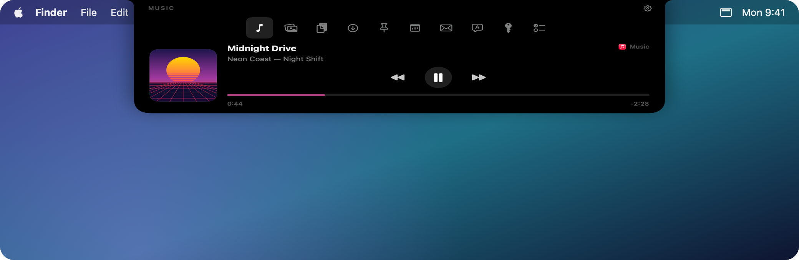

## Features

### A panel that lives in the notch

- Hover over the notch — or click it, if you prefer — and the panel slides out.
- Move the pointer away, click outside or press <kbd>Esc</kbd> to close it.
- It stays pinned to the notch while you swipe between desktops and never pops up in Mission Control.
- While music plays, the album art and a small equalizer sit right next to the closed notch.

### The panel, your way

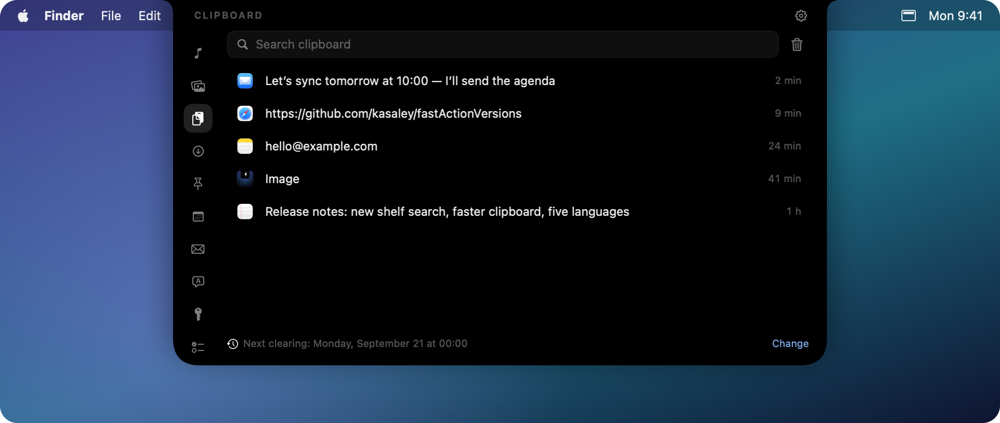

- **Tabs on the left or on top.** A row of tabs can sit on the left, centred or on the right.
- **Three panel sizes** — small, medium and large; the size sets the width, the height and the icons at once.
- **Icon size** has a slider of its own, for tabs larger or smaller than the size implies.
- Tabs with nothing to scroll — the player, the shelf in a row — shrink the panel to their own height.
  The rest keep the size you picked, so the window never moves out from under the pointer.

### Now Playing

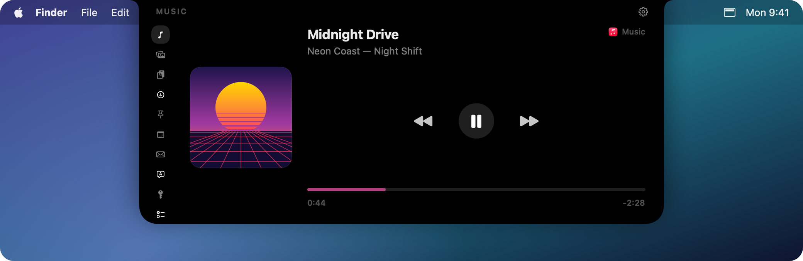

Control whatever is playing: Music, Spotify, a browser or any other player that reports to macOS.
Play, pause, skip and scrub through the track; click the app name to jump to the player.

### Shots

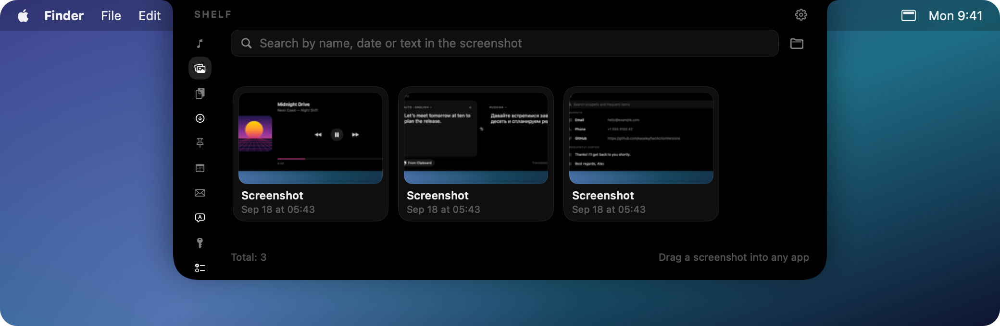

- Screenshots (<kbd>⌘⇧3</kbd>, <kbd>⌘⇧4</kbd>) and screen recordings (<kbd>⌘⇧5</kbd>) land in Shots instead of on your desktop.
- Search by name, date or **the text inside a screenshot** — recognized on your Mac.
- Drag a screenshot straight into any app; hover and click ✕ to move it to the Trash.
- **A row or a grid** — your choice, and the grid takes from 2 to 6 columns.

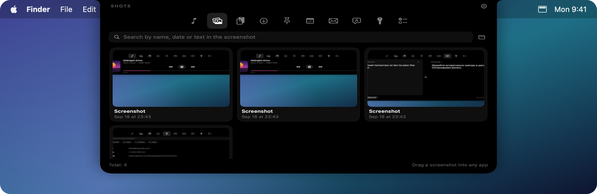

### Clipboard history

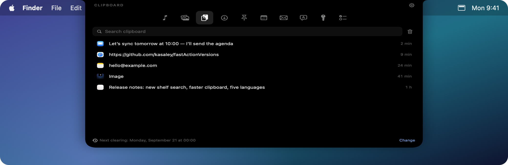

- Everything you copy — text, images and files — with search.
- Click an item to copy it again, or have it pasted into the active app right away.
- History is cleared automatically: every day, week or month, at the time you choose.
- Passwords from password managers are never saved.

### Pin and frequently copied

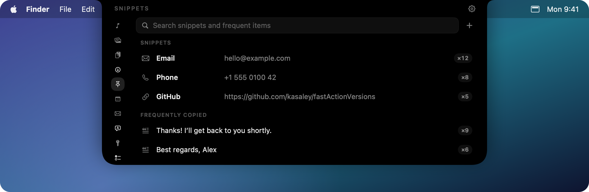

Keep the texts you paste all the time — your email, phone number, links — one click away.
What you copy most often appears here on its own, and you can pin it.

- **The type is worked out on its own**: email, link, IP address, postal address, bank card,
  crypto wallet (BTC, ETH, TRON, LTC, SOL), phone number, handle. All of it locally, from the text itself.
- The strip of types above the list narrows it down — to wallets only, say.
- A card is recognised by its checksum, so a long order number never becomes one, and the number
  is covered in the list: `4012 •••• •••• 1881`. Copying still gives you all of it.

### Recent downloads

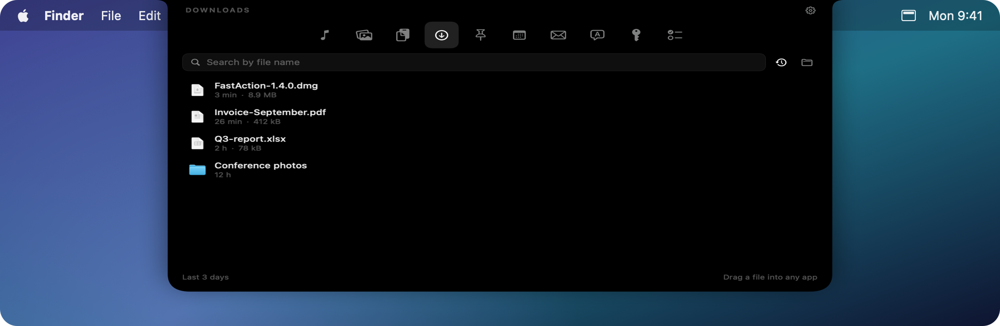

- The files that landed in your Downloads folder, newest first, with their size and when they arrived.
- Choose how far back the tab looks: today, three days, a week, a month or everything.
- Click to open, hover to show a file in Finder or move it to the Trash, or drag it straight into another app.
- A file that finishes downloading says so in the notch.

### Calendar

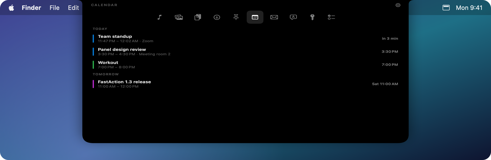

- Your next week of meetings, each in the colour of its calendar.
- A meeting with a Zoom, Meet, Teams or Webex link gets a **Join** button.
- Click an event to read the details in the panel, or open it in Calendar from the row.
- A few minutes before a meeting the notch pops out with a reminder and a sound — you choose how early.

### Mail

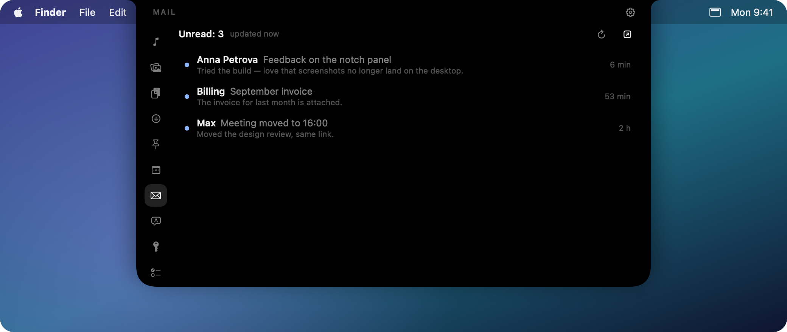

- Unread messages from Apple Mail, newest first.
- Click one to read it in the panel, laid out as the sender wrote it, images included.
  Pictures that travel inside the message show up right away; remote ones wait for **Show images**,
  because they are often tracking pixels.
- Opening a message marks it as read; one button puts it back.
- Hover a row to open it in Mail or mark it as read without opening.
- New mail pops out of the notch, and the Mail tab keeps a dot until you look.

### Jira — a plugin

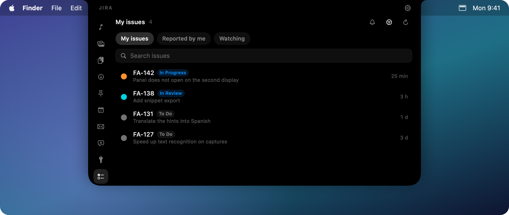

Installed separately: **Settings → Plugins → Jira → Install**.

- Your issues by JQL filter — as many filters as you like, switched with a click.
- Status and priority show in the row; search matches the key and the summary.
- Click an issue to read it in the panel: description and the latest comments.
- On hover: open it in the browser, copy the issue key, or copy the link.
- New issues in a filter are announced by the notch.
- Works with Jira Cloud (email + API token) and with Server / Data Center (personal token).

### 1Password — a plugin

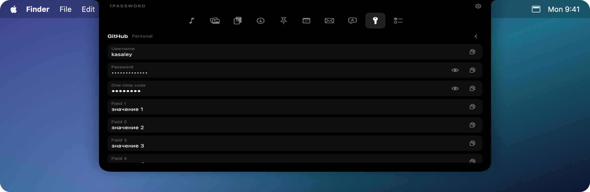

Installed separately: **Settings → Plugins → 1Password → Install**.

- The items you reach for most, through the official `op` tool you install yourself.
  If it is missing, the plugin shows how to install it and offers to copy the command.
- Nothing is fetched in the background: the list opens when you ask, and that is when
  1Password asks for Touch ID.
- Inside an item: username, password, one-time code and the rest. Concealed values stay
  masked until you reveal them.
- Copying marks the value as a secret — it never enters the clipboard history and is cleared on a timer.
- **Autofill** types the username and password into the app in front.

### Confirmation codes

When a code arrives by email it lands in the notch on its own: large, with a **Copy** button and a
cross. Copying closes the banner. It stays up longer than an ordinary alert — ten seconds, and that
is a setting.

A number counts as a code only when a word like "code", "verification" or "OTP" stands next to it.
Order numbers, phone numbers, sums, dates, years, postcodes and card numbers are not codes — the
self-test covers 27 cases, half of which check that we do **not** fire.

Codes from **iMessage and SMS** are found too, once that is switched on in **Settings →
Notifications**. Reading the Messages database asks macOS for Full Disk Access; only new incoming
messages are read, and only to look for a code — nothing is stored and nothing is shown in a tab.

### Notifications in the notch

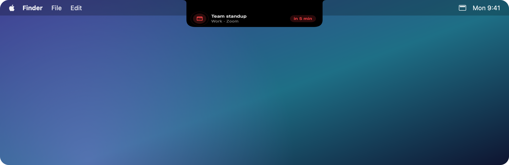

The notch stretches into a small banner, plays a sound and gives the trackpad a gentle tap.
Hover it while it is up and the right tab opens straight away.

**Settings → Notifications** holds the rules for all of them: how long a banner stays, the sound and
trackpad feedback, and a single switch that turns alerts off. While a Focus is on they stay quiet by
default — the tab still keeps its dot, so nothing is lost.

### On-device translator

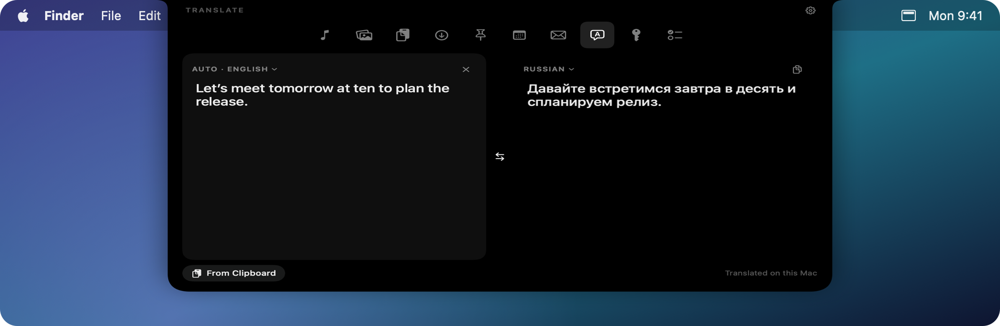

The language is detected as you type. Translation runs entirely on your Mac through Apple Translation:
no internet connection and no API keys. If a language pack is missing, **Download languages** takes
you to **Settings → Translate**, where it is downloaded and you can see how it went.

### Keyboard shortcuts

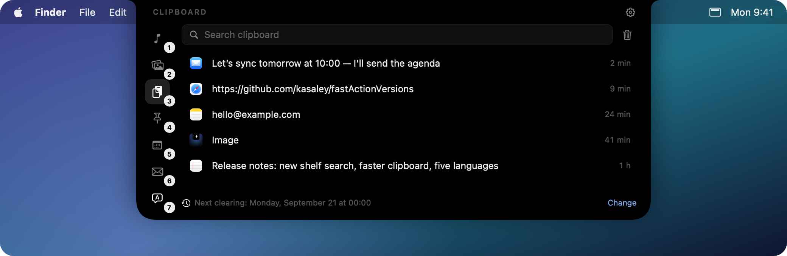

While the panel is open, <kbd>⌘1</kbd>…<kbd>⌘9</kbd> switch tabs — hold <kbd>⌘</kbd> to see the hints.
The panel's shortcuts take priority over the app underneath, and when it's closed they work in your apps as usual.
Any tab can get its own shortcut.

## Nearly everything is a setting

Every tab, every alert and every plugin permission is yours to decide.
Four of the ten settings pages:

### Panel

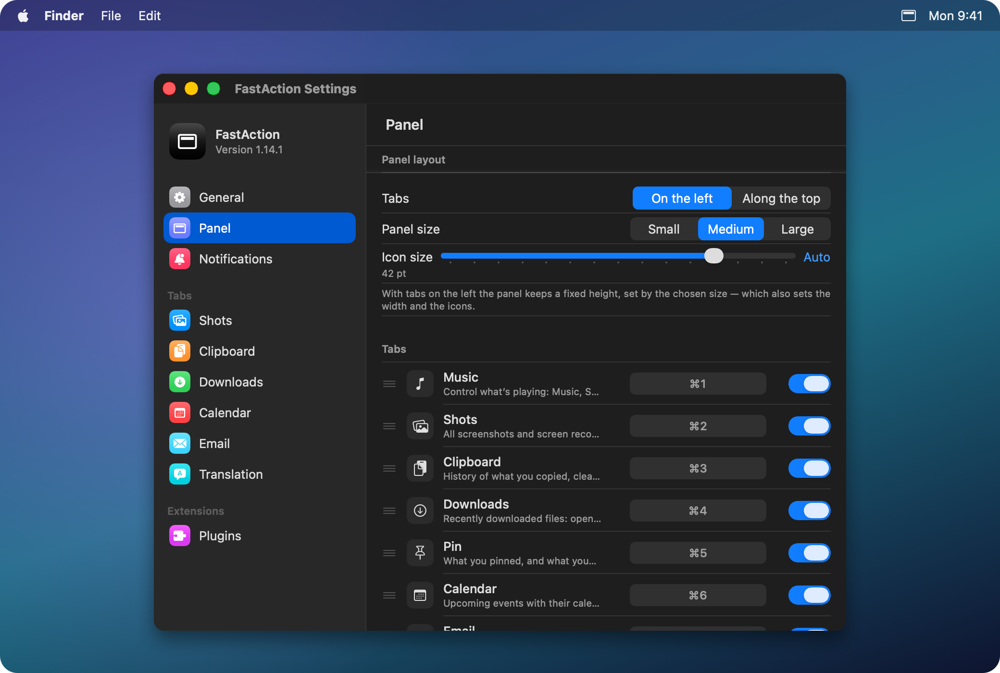

Tabs on the left or on top and where the row sits, three window sizes, a slider of its own for the icons.
Below that, the tabs themselves: drag to reorder, switch off the ones you never open, and give any of
them a shortcut of your own instead of <kbd>⌘1</kbd>…<kbd>⌘9</kbd>.

### Notifications

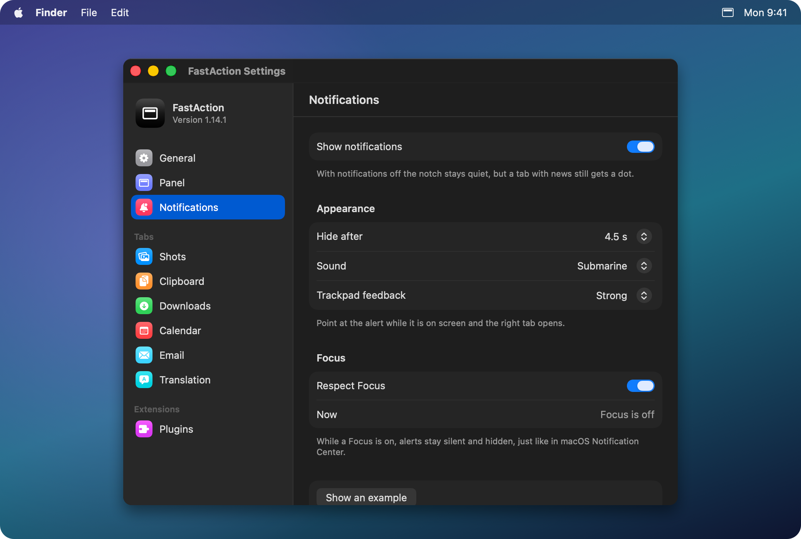

How long a banner stays, which sound it makes, how firmly the trackpad taps — and one switch for the
days you want none of it. Focus is respected by default, and the page tells you whether it is on
right now.

### Clipboard

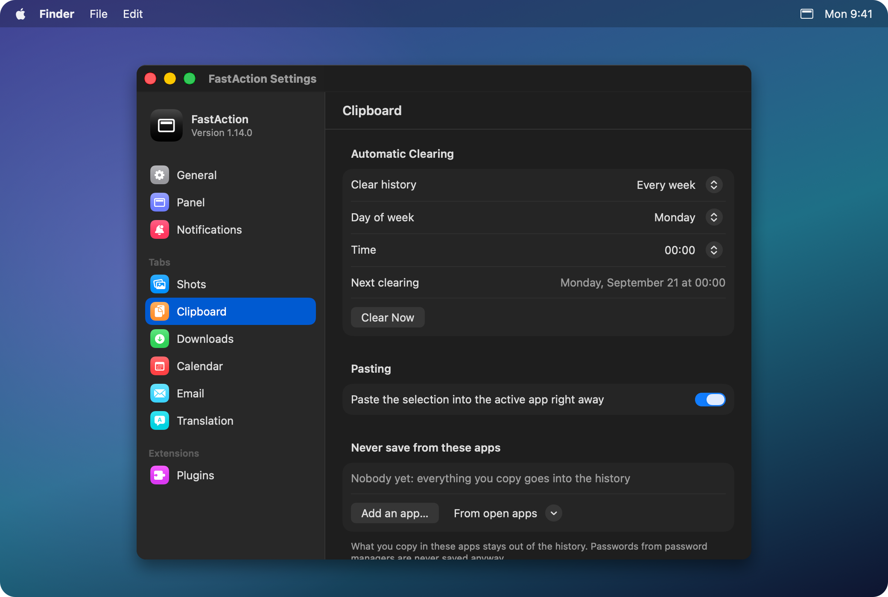

Automatic clearing — daily, weekly or monthly, on the day and hour you pick, with the next run spelled out.
And a list of apps whose copies never reach the history: your bank, your password manager, a work chat.

### Plugins

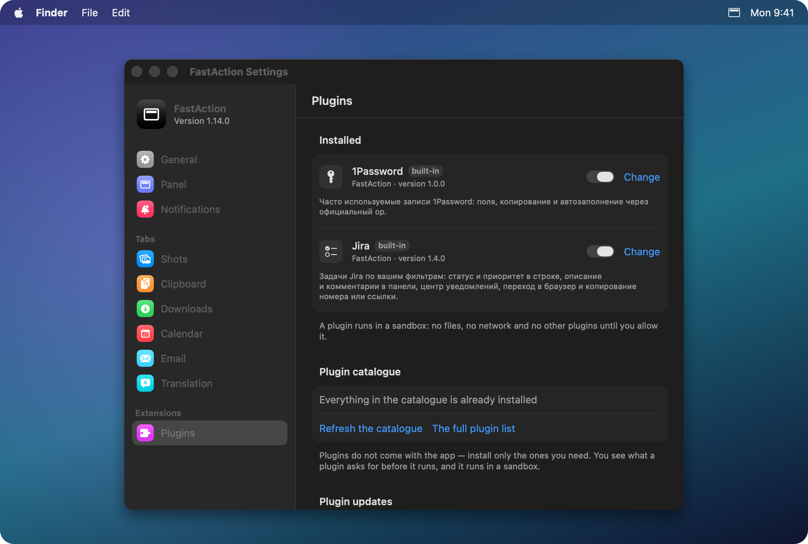

The catalogue, installing and removing, automatic updates — and each plugin's permissions, one by one.
What a plugin asks for is visible before you install it, a permission can be taken back at any moment,
and the plugin's log shows every call it makes to the system.

### And also

- Open the panel on hover or on click, with an optional delay.
- Five interface languages, switched instantly.
- Which parts of the panel to show: the tab caption, the gear, the activity next to the closed notch.
- Open at login and automatic updates.

## How people use it

- **A call in a minute.** The notch opens with a reminder and a **Join** button that starts Zoom
  or Meet — no digging through email for the link.
- **A screenshot into a chat.** <kbd>⌘⇧4</kbd>, and the capture is already in Shots, ready to be
  dragged straight into the conversation. The desktop stays clean.
- **Details at hand.** Email, phone, delivery address and card number live in Pin, labelled by type:
  pick the type, click, and it is pasted.
- **“Where did I see that link?”** Search the clipboard history and it turns up in a couple of
  letters, even if you copied it the day before yesterday.
- **Issues between other things.** The “Waiting for my review” filter in Jira, the description and
  comments right in the panel, and the issue key copied with one click — for the branch name.
- **A password without switching windows.** 1Password opens with Touch ID, and Autofill types the
  login and the password into the active app.
- **A letter in a language you do not read.** The translator works on the device: no internet, no keys.
- **A file you just downloaded.** Downloads keeps it on top — open it, show it in Finder or drag it
  onward without opening Finder at all.

## Plugins

Plugins do not come with the app: you install the ones you need in **Settings → Plugins**.
The full list — with the authors' own descriptions and links to their repositories — lives on a
separate page: **[The plugin catalogue](docs/catalog.md)**. Add yours there with a pull request.
Both integrations — Jira and 1Password — are written on the open plugin API and run in a sandbox:
a plugin gets no files, no network beyond the hosts it declared, and no access to other plugins
until you allow it. Permissions are granted one by one and revoked any time in
**Settings → Plugins**, and every call into the system shows up in the plugin's log.

Your own plugin is a folder with `manifest.json` and a `plugin.js` written in JavaScript.
How to write one, what it can reach and what it cannot: [docs/PLUGINS.md](docs/PLUGINS.md).

## Installation

1. Download `FastAction-<version>.dmg` from the [latest release](https://github.com/kasaley/fastActionVersions/releases/latest).
2. Open it and drag **FastAction** to **Applications**.
3. Launch FastAction from Applications. Its icon appears in the menu bar.

> [!NOTE]
> FastAction isn't notarized by Apple yet, so on the first launch macOS may say it can't verify the developer.
> Click **Done**, open **System Settings → Privacy & Security** and click **Open Anyway**. This is needed only once.

## Updates

FastAction checks for updates once a day and installs them in a couple of clicks.
To check right now, click the menu bar icon and choose **Check for Updates…**
Automatic checks and installs can be changed in **Settings → General → Updates**.

## Privacy

- Messages are read only while code detection is on: new incoming ones only, only to look for a
  code, and never stored.
- Your clipboard history, pinned items and screenshots stay on your Mac. There are no accounts and no analytics;
  the only network request is the daily update check to GitHub.
- Text recognition and translation run on-device.
- Saving screenshots to Shots changes the macOS screenshot folder; turning it off restores the previous one.
- **Accessibility** access is optional and needed only for pasting a picked item right away.

## Requirements

- macOS 15 Sequoia or later.
- Designed for MacBooks with a notch. On other displays FastAction shows a small virtual notch at the top center.
- The translator uses Apple language packs, downloaded on first use.

## Troubleshooting

**The panel doesn't open.** Make sure FastAction is running (its icon is in the menu bar) and check
**Settings → General → Open panel**: it may be set to open on click. The panel doesn't open in Mission Control by design.

**Music doesn't show up.** The player has to report to the macOS Now Playing service — the same one that powers the media keys.

**Calendar or Mail asks for permission.** Calendar access is requested when you open the tab;
Mail needs Automation access in **System Settings → Privacy & Security → Automation**.
FastAction never launches Mail on its own.

**The translator asks to download languages.** Click **Download**, or add them in
**System Settings → General → Language & Region → Translation Languages**.

**Screenshots still go to the desktop.** Open the **Shots** tab and click **Turn On**.

## Feedback

Found a bug or have an idea? [Open an issue](https://github.com/kasaley/fastActionVersions/issues).

## Coming next

The plugin API and the catalogue are here already — [how to write one](docs/PLUGINS.md).
Next: more ready-made integrations, settings that follow you between Macs, and notarization,
so the first launch comes without a warning.
