

  

<h1 align="center">FastAction</h1>

  Панель быстрых действий в челке MacBook. 
  Музыка, скриншоты, буфер обмена, загрузки, Pin и переводчик — на расстоянии одного наведения курсора. 
  Вкладки, размеры, уведомления и плагины — всё настраивается под себя.

  <a href="https://github.com/kasaley/fastActionVersions/releases/latest"><b>⬇︎ Скачать последнюю версию</b></a>

  macOS 15 и новее · Apple silicon и Intel · Русский, English, Español, Deutsch, Français

<a href="README.md">English</a> · <b>Русский</b>

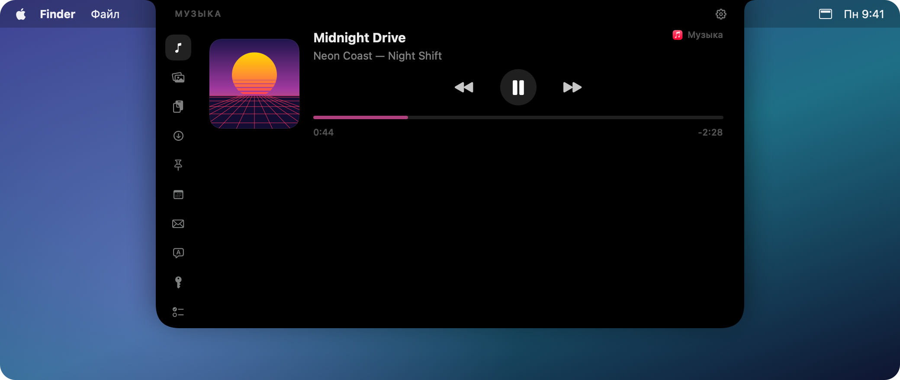

## Возможности

### Панель, которая живёт в челке

- Наведите курсор на челку — или кликните по ней, если так удобнее, — и панель плавно выедет.
- Чтобы закрыть, уведите курсор, кликните мимо или нажмите <kbd>Esc</kbd>.
- Панель остаётся на месте, пока вы листаете рабочие столы, и не открывается в Mission Control.
- Пока играет музыка, возле закрытой челки видны обложка и маленький эквалайзер.

### Панель под свой вкус

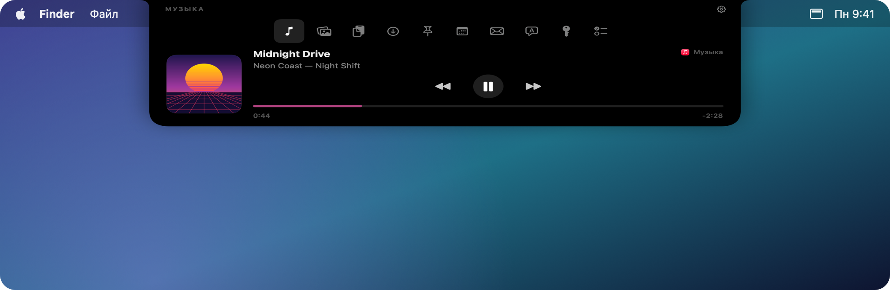

- **Вкладки слева или сверху.** Горизонтальную полосу можно прижать влево, вправо или оставить по центру.
- **Три размера панели** — маленький, средний и большой; размер задаёт ширину, высоту и величину значков.
- **Размер значков** настраивается отдельным ползунком, если хочется крупнее или мельче.
- Вкладки, которым нечего прокручивать, — музыка и Shots в строку — сжимают панель до своей высоты.
  Остальные держат выбранный размер, чтобы окно не прыгало под курсором.

### Сейчас играет

Управление тем, что играет: Музыка, Spotify, браузер или любой другой плеер, который сообщает macOS о воспроизведении.
Пауза, переключение и перемотка трека; клик по названию приложения открывает плеер.

### Shots

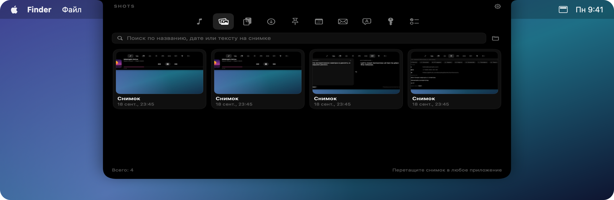

- Скриншоты (<kbd>⌘⇧3</kbd>, <kbd>⌘⇧4</kbd>) и записи экрана (<kbd>⌘⇧5</kbd>) попадают в Shots, а не на рабочий стол.
- Поиск по названию, дате и **тексту на самом снимке** — распознаётся прямо на Mac.
- Снимок можно перетащить в любое приложение; при наведении крестик отправляет его в Корзину.
- **Строкой или сеткой** — на выбор, а число колонок в сетке задаётся от 2 до 6.

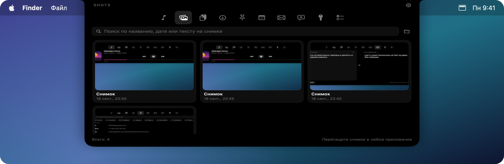

### История буфера обмена

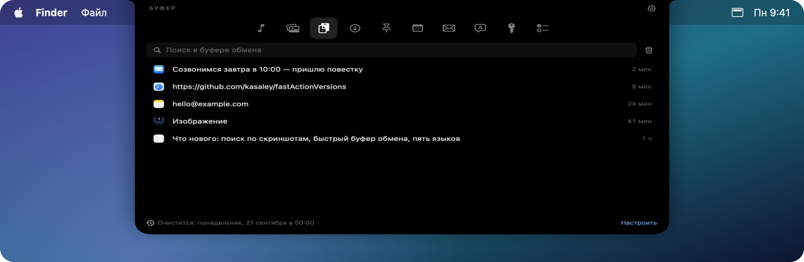

- Всё, что вы копировали: текст, картинки и файлы, с поиском.
- Клик копирует запись снова или сразу вставляет её в активное приложение.
- История очищается автоматически: раз в день, неделю или месяц, в выбранное время.
- Пароли из менеджеров паролей не сохраняются.

### Pin и частое

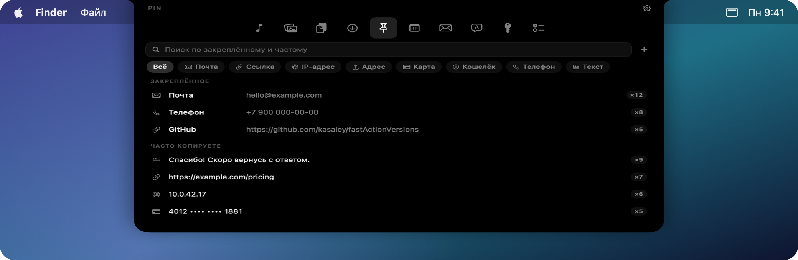

Тексты, которые вы вставляете постоянно — почта, телефон, ссылки, — всегда в один клик.
То, что вы копируете чаще всего, появляется здесь само, и это можно закрепить.

- **Тип определяется сам**: почта, ссылка, IP-адрес, почтовый адрес, банковская карта,
  криптокошелёк (BTC, ETH, TRON, LTC, SOL), телефон, ник. Всё считается на месте, по самой строке.
- Полоса типов над списком оставляет только нужное — например, одни кошельки.
- Карта узнаётся по контрольной сумме, поэтому длинный номер заказа картой не станет,
  а её номер в списке прикрыт: `4012 •••• •••• 1881`. Копируется при этом целиком.

### Последние загрузки

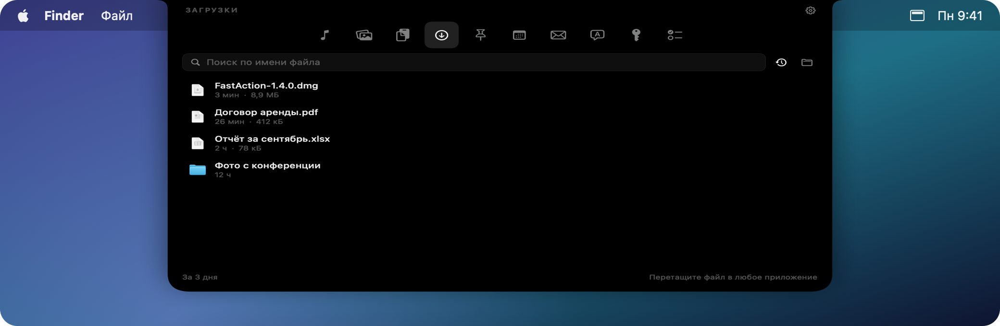

- Файлы из папки «Загрузки», новые сверху, с размером и временем появления.
- За какой период показывать — за сегодня, три дня, неделю, месяц или всё сразу.
- Клик открывает файл, при наведении можно показать его в Finder или отправить в Корзину,
  а ещё файл можно перетащить прямо в другое приложение.
- Когда файл докачается, челка об этом скажет.

### Календарь

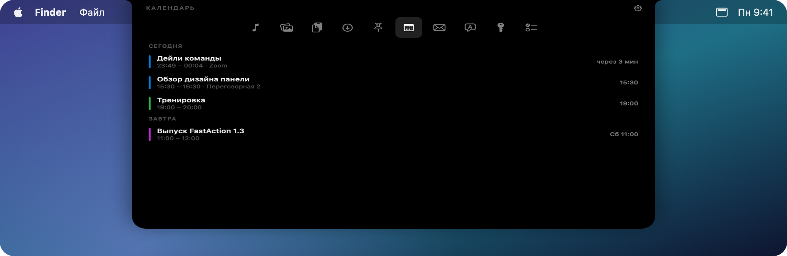

- Встречи на неделю вперёд, каждая в цвете своего календаря.
- Если во встрече есть ссылка на Zoom, Meet, Teams или Webex, появляется кнопка **Присоединиться**.
- Клик по встрече открывает подробности прямо в панели, а из строки можно перейти в Календарь.
- За несколько минут до начала челка раскрывается с напоминанием и звуком; за сколько именно — настраивается.

### Почта

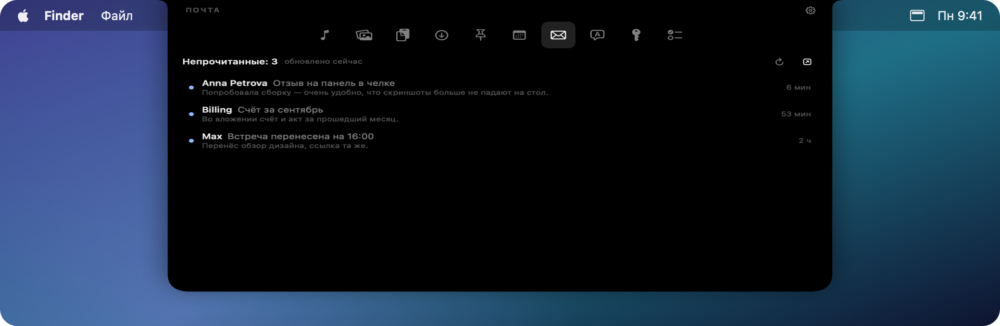

- Непрочитанные письма из Apple Mail, новые сверху.
- Клик открывает письмо прямо в панели — с вёрсткой и картинками, как его отправили.
  Картинки из самого письма видны сразу, внешние ждут кнопки **«Показать картинки»**: чаще всего это следящие пиксели.
- Открытое письмо сразу помечается прочитанным, вернуть его обратно можно одной кнопкой.
- При наведении на строку можно перейти в Почту или отметить прочитанным, не открывая.
- О новом письме сообщает челка, а на вкладке «Почта» остаётся точка, пока вы не заглянете.

### Jira — плагин

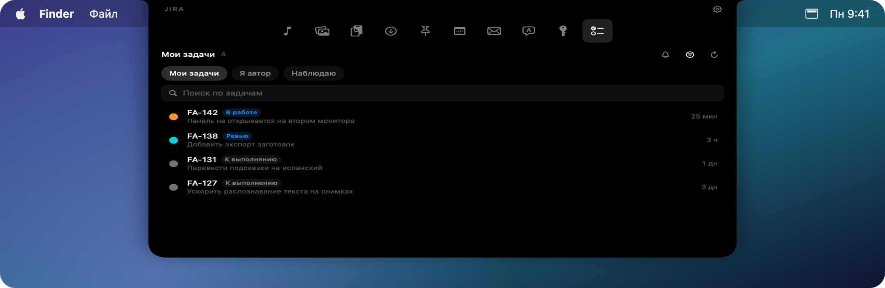

Ставится отдельно: **Настройки → Плагины → Jira → Установить**.

- **Подключение по шагам**: адрес → почта → токен. Каждый шаг проверяется на кнопке «Далее»,
  вернуться можно на любой, а если Jira откажет — мастер сам приведёт на тот шаг, из-за которого отказала.
- Задачи по вашим фильтрам JQL: своих фильтров можно завести сколько угодно, переключаются кнопками.
  Фильтры подтягиваются из самой Jira — все, с поиском по названию и JQL; избранные идут первыми.
- **Центр уведомлений** внутри вкладки: всё, о чём плагин сообщал, собрано в одном месте,
  помечается прочитанным по одному или разом.
- Наблюдаемые задачи: об изменениях в них плагин скажет отдельно.
- Статус и приоритет видны в строке, поиск работает по номеру и теме.
- Клик открывает задачу прямо в панели — описание и последние комментарии.
- При наведении: перейти в браузер, скопировать номер задачи или ссылку на неё.
- О новых задачах в фильтре сообщает челка.
- Работает и с Jira Cloud (почта + API-токен), и с Server / Data Center (личный токен).

### 1Password — плагин

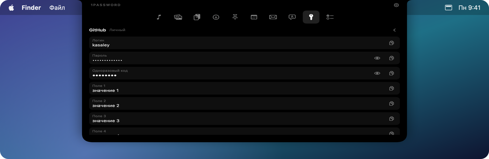

Ставится отдельно: **Настройки → Плагины → 1Password → Установить**.

- Часто используемые записи из 1Password — через официальный `op`, который вы ставите сами.
  Если его нет, плагин покажет, как установить, и даст скопировать команду.
- Список не запрашивается в фоне: он открывается по вашей команде, тогда же 1Password просит Touch ID.
- Внутри записи — логин, пароль, одноразовый код и остальные поля. Скрытые показываются точками,
  пока вы сами не откроете их.
- Копирование помечает значение как секретное: оно не попадает в историю буфера и очищается по таймеру.
- Кнопка «Автозаполнить» вводит логин и пароль в активное приложение.

### Уведомления в челке

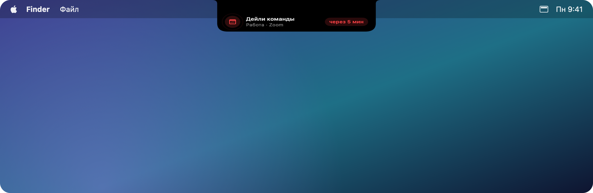

Челка растягивается в небольшую плашку, звучит сигнал и трекпад слегка вибрирует.
Наведите на неё курсор, пока она видна, и сразу откроется нужная вкладка.

В разделе **Настройки → Уведомления** собраны общие правила: сколько плашка висит, звук и вибрация,
а также выключатель для всех уведомлений сразу. Пока включено фокусирование, они по умолчанию молчат —
точка на вкладке всё равно остаётся, так что ничего не теряется.

### Переводчик на устройстве

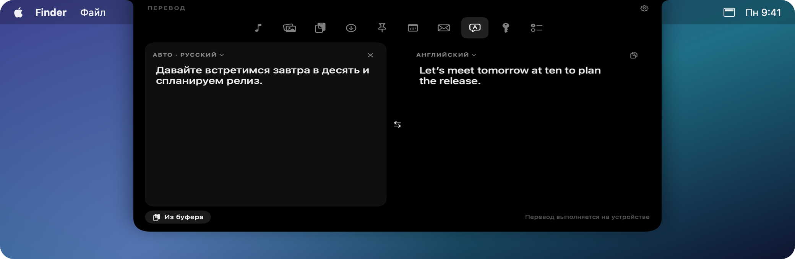

Язык определяется, пока вы печатаете. Перевод выполняется целиком на Mac через Apple Translation:
без интернета и без ключей API. Если языкового пакета нет, кнопка **«Скачать языки»** ведёт
в **Настройки → Перевод**, где его можно загрузить и увидеть, чем дело кончилось.

### Горячие клавиши

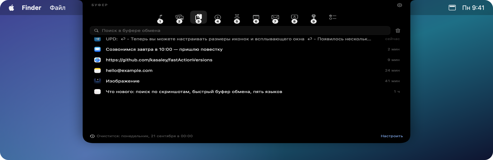

Пока панель открыта, <kbd>⌘1</kbd>…<kbd>⌘9</kbd> переключают вкладки — зажмите <kbd>⌘</kbd>, чтобы увидеть подсказки.
Сочетания панели важнее сочетаний приложения под ней, а когда панель закрыта, они работают в приложениях как обычно.
Любой вкладке можно назначить своё сочетание.

## Настраивается почти всё

Каждая вкладка, каждое уведомление и каждое разрешение плагина — под вашим контролем.
Ниже четыре раздела настроек из десяти.

### Панель

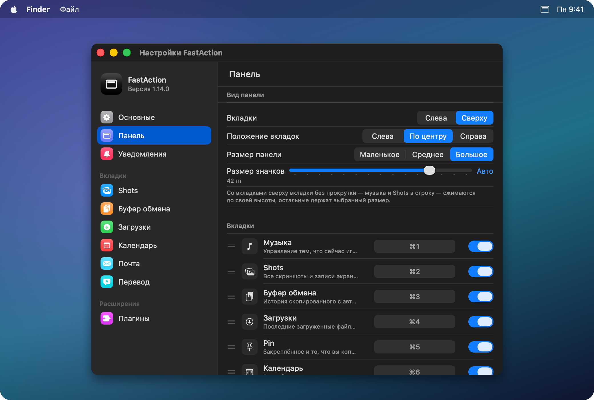

Вкладки слева или сверху и их положение в строке, три размера окна, отдельный ползунок размера значков.
Ниже — список вкладок: порядок меняется перетаскиванием, ненужные выключаются,
каждой можно назначить своё сочетание клавиш вместо <kbd>⌘1</kbd>…<kbd>⌘9</kbd>.

### Уведомления

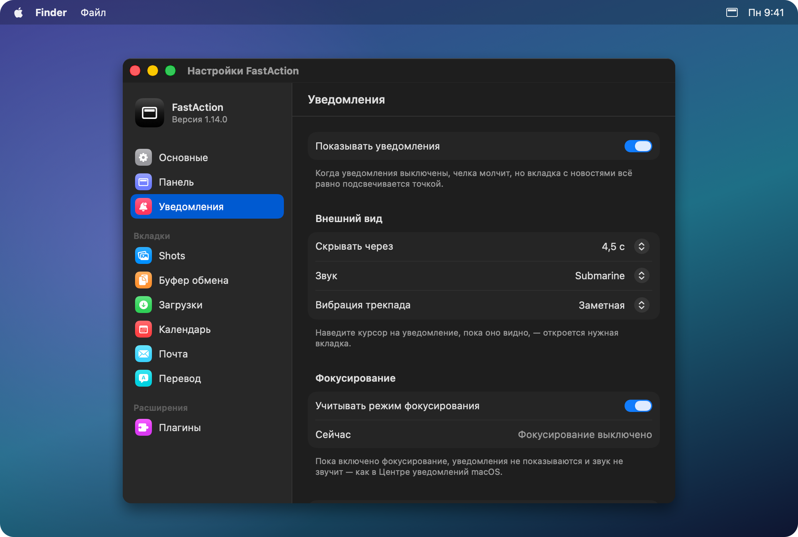

Сколько плашка висит, какой звук, насколько заметно вибрирует трекпад — и общий выключатель,
если сегодня не до уведомлений. Режим фокусирования учитывается по умолчанию, и тут же видно,
включён ли он прямо сейчас.

### Буфер обмена

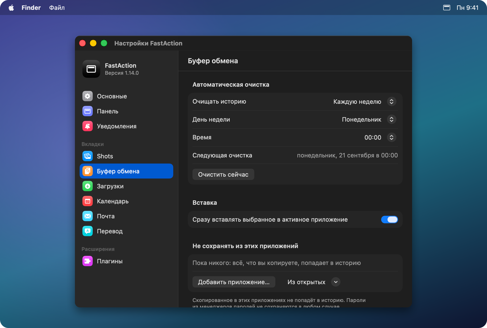

Автоочистка — раз в день, неделю или месяц, в выбранный день и час, и видно, когда она сработает.
Отдельный список приложений, из которых копировать в историю не нужно: банк, менеджер паролей, рабочий чат.

### Плагины

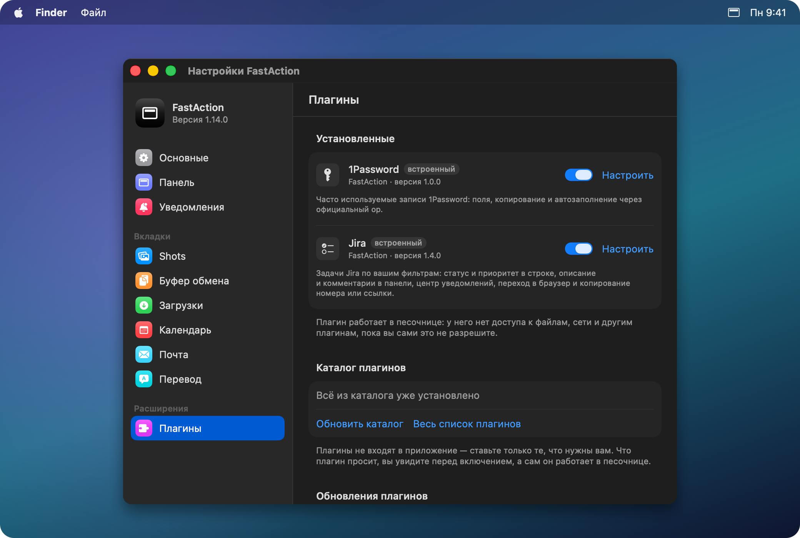

Каталог, установка и удаление, автообновление — и разрешения по пунктам у каждого плагина.
Что плагин просит, видно до установки; отозвать разрешение можно в любой момент, а в журнале
плагина видно каждое его обращение к системе.

### И ещё

- Открытие при наведении или по клику, с задержкой или без.
- Пять языков интерфейса, переключаются мгновенно.
- Какие элементы показывать в панели: подпись вкладки, шестерёнку, активность у закрытой челки.
- Запуск при входе в систему и автоматические обновления.

## Как этим пользуются

- **Созвон через минуту.** Челка сама раскрывается с напоминанием, кнопка **Присоединиться**
  открывает Zoom или Meet — не нужно искать письмо со ссылкой.
- **Скриншот в переписку.** <kbd>⌘⇧4</kbd> — и снимок уже в Shots, откуда его можно перетащить
  прямо в чат. Рабочий стол при этом остаётся чистым.
- **Реквизиты под рукой.** Почта, телефон, адрес доставки и номер карты лежат в Pin и подписаны
  по типу: выбрал нужный тип, кликнул — вставилось.
- **«Где же я видел эту ссылку».** Поиск по истории буфера обмена находит её за пару букв,
  даже если копировали позавчера.
- **Задачи между делом.** Фильтр «Ревью на мне» в Jira, описание и комментарии прямо в панели,
  номер задачи копируется одной кнопкой — для названия ветки.
- **Пароль без переключения окон.** 1Password открывается по Touch ID, «Автозаполнить» вводит
  логин и пароль в активное приложение.
- **Письмо на незнакомом языке.** Переводчик работает на устройстве: ни интернета, ни ключей.
- **Только что скачанный файл.** Загрузки показывают его сверху — открыть, показать в Finder
  или перетащить дальше, не открывая Finder вовсе.

## Плагины

Плагины не входят в приложение: вы ставите только те, что нужны вам, в **Настройки → Плагины**.
Полный список — с описаниями от авторов и ссылками на их репозитории — на отдельной странице:
**[Каталог плагинов](docs/catalog.md)**. Туда же можно добавить свой, прислав pull request.
Обе интеграции — Jira и 1Password — написаны на открытом API плагинов и работают в песочнице:
у плагина нет доступа к файлам, к сети (кроме адресов, которые он назвал) и к другим плагинам,
пока вы сами это не разрешите. Разрешения выдаются по пунктам и отзываются в любой момент
в **Настройки → Плагины**, а каждое обращение к системе видно в журнале плагина.

Свой плагин — это папка с `manifest.json` и `plugin.js` на JavaScript.
Как их писать, что доступно и что запрещено — в [docs/PLUGINS.md](docs/PLUGINS.md).

## Установка

1. Скачайте `FastAction-<версия>.dmg` из [последнего релиза](https://github.com/kasaley/fastActionVersions/releases/latest).
2. Откройте его и перетащите **FastAction** в **Программы**.
3. Запустите FastAction из «Программ». Значок появится в строке меню.

> [!NOTE]
> FastAction пока не нотаризован Apple, поэтому при первом запуске macOS может сказать, что не может проверить разработчика.
> Нажмите **Готово**, откройте **Системные настройки → Конфиденциальность и безопасность** и нажмите **Всё равно открыть**. Это нужно один раз.

## Обновления

FastAction раз в сутки проверяет обновления и устанавливает их в пару кликов.
Проверить прямо сейчас: значок в строке меню → **Проверить обновления…**
Автопроверка и автоустановка настраиваются в **Настройки → Основные → Обновления**.

## Конфиденциальность

- История буфера обмена, Pin и скриншоты хранятся только на вашем Mac. Нет аккаунтов и аналитики;
  единственный сетевой запрос — ежедневная проверка обновлений на GitHub.
- Распознавание текста и перевод работают на устройстве.
- Сохранение скриншотов в Shots меняет системную папку снимков; при выключении возвращается прежняя.
- Доступ к **Универсальному доступу** необязателен и нужен только для мгновенной вставки выбранной записи.

## Требования

- macOS 15 Sequoia и новее.
- Создан для MacBook с челкой. На других мониторах FastAction показывает небольшую виртуальную челку сверху по центру.
- Переводчику нужны языковые пакеты Apple, они загружаются при первом использовании.

## Если что-то не работает

**Панель не открывается.** Проверьте, что FastAction запущен (значок в строке меню), и загляните в
**Настройки → Основные → Открывать панель**: возможно, выбрано открытие по клику. В Mission Control панель не открывается специально.

**Не видно музыки.** Плеер должен сообщать macOS о воспроизведении — так же, как для медиаклавиш.

**Календарь или Почта просят разрешение.** Доступ к календарю запрашивается при открытии вкладки;
Почте нужен доступ в разделе **Системные настройки → Конфиденциальность и безопасность → Автоматизация**.
Почту FastAction сам не запускает.

**Переводчик просит загрузить языки.** Нажмите **Загрузить** или добавьте языки в
**Системные настройки → Основные → Язык и регион → Языки перевода**.

**Скриншоты всё ещё сохраняются на рабочий стол.** Откройте вкладку **Shots** и нажмите **Включить**.

## Обратная связь

Нашли ошибку или есть идея? [Создайте issue](https://github.com/kasaley/fastActionVersions/issues).

## Что дальше

API плагинов и каталог уже работают — [как написать свой](docs/PLUGINS.md).
Дальше: больше готовых интеграций, обмен настройками между Mac и нотаризация у Apple,
чтобы первый запуск обходился без предупреждения.
